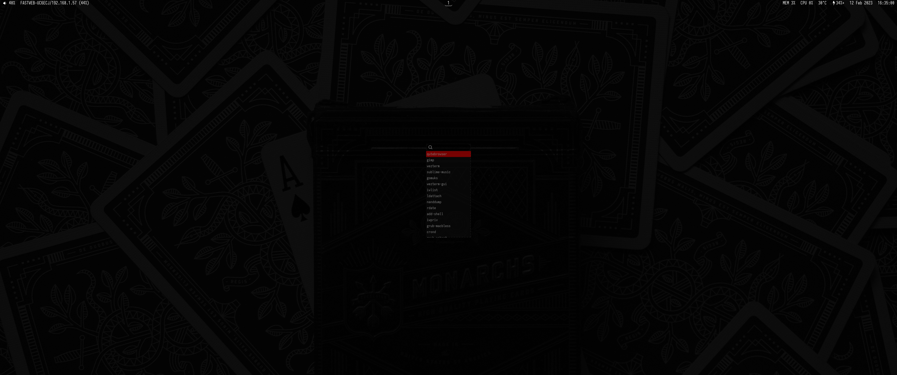
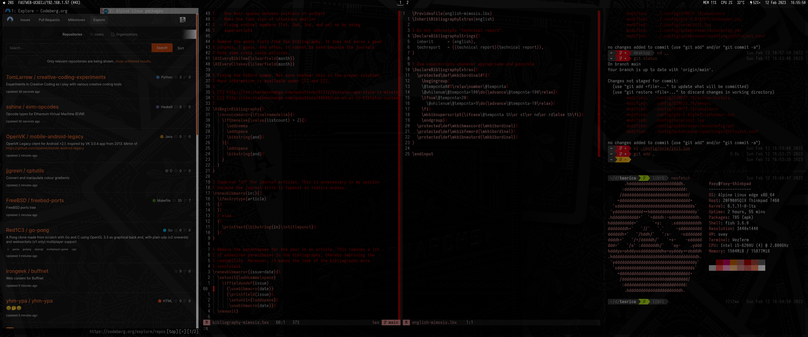
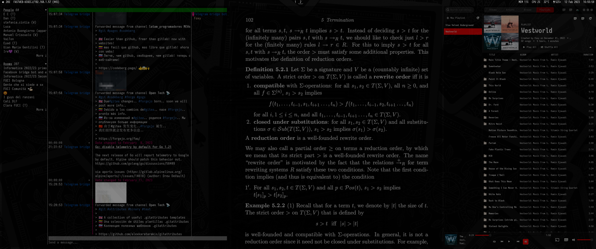

# .dotfiles

Ricing, dotfiles, wallpapers, and more from my current setup.

- distro: _Alpine Linux_
- shell: _Fish_
- display server: _Wayland_
- window manager: _Sway_
- terminal emulator: _WezTerm_
- status bar: _Waybar_
- launcher: _Wofi_
- fetch: _Neofetch_
- editor: _Neovim_
- browser: _qutebrowser_
- PDF reader: _zathura_
- chat client: _gomuks_
- music player: _Sublime Music_

